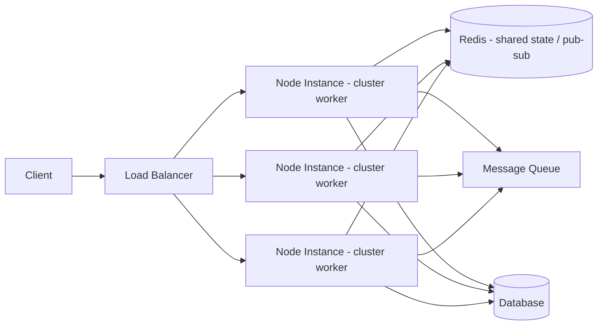
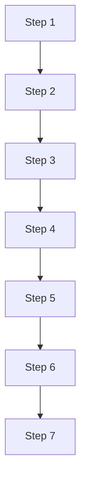

## Diagram + Trailing Paragraph



<!-- align: center -->

Because `cluster` workers don't share memory, session state, rate limits, and pub-sub **must** live outside the process — Redis or an equivalent, not a module-level `Map`.

---

## A Very Long Single Paragraph

Distributed systems fail in ways that single-process applications never do, and the failure modes are rarely obvious from a local development environment: a load balancer that round-robins requests across four worker processes will happily route two requests belonging to the same logical session to two different workers, and if that session's state was only ever held in a plain in-memory object on one of those workers, the second worker has no way of knowing it exists, which is precisely the kind of bug that passes every unit test, passes every local manual check, and then shows up three weeks after a production deploy as an inexplicable, seemingly random logout affecting roughly one in four users, and by the time anyone notices the pattern the incident channel already has forty messages in it.

---

## Long Bullet List

<!-- layout: bullets -->

- Blocking the event loop with synchronous crypto or big JSON payloads
- Unbounded in-memory caches that never evict anything
- Unhandled promise rejections silently swallowed until a crash
- Event listener leaks from per-request `EventEmitter` subscriptions
- Thread pool starvation from too much `fs`/`dns`/`crypto.pbkdf2` work
- Session state trapped on a single worker process
- Rate limiters that reset per-process instead of globally
- Cache stampedes when many requests miss at once
- Retry storms that amplify a downstream outage
- Connection pool exhaustion under bursty load
- Memory leaks from long-lived closures over request objects
- Head-of-line blocking on a single slow dependency

---

## Dense Table

| Service       | Owner    | Region    | p50   | p99    | Error Rate | On-call |
| ------------- | -------- | --------- | ----- | ------ | ---------- | ------- |
| auth-api      | Platform | us-east-1 | 12ms  | 180ms  | 0.02%      | @alice  |
| billing-api   | Payments | us-east-1 | 40ms  | 420ms  | 0.10%      | @bob    |
| search-api    | Search   | eu-west-1 | 25ms  | 300ms  | 0.05%      | @carol  |
| notify-api    | Growth   | us-west-2 | 8ms   | 90ms   | 0.01%      | @dave   |
| media-api     | Platform | us-east-1 | 60ms  | 900ms  | 0.30%      | @erin   |
| gateway       | Platform | global    | 5ms   | 60ms   | 0.01%      | @frank  |
| reporting-api | Data     | us-east-1 | 200ms | 2200ms | 0.40%      | @grace  |
| ingest-worker | Data     | us-east-1 | n/a   | n/a    | 0.15%      | @heidi  |

---

## Oversized Image

<!-- align: center -->


This caption sits directly under a deliberately oversized image to check whether the image shrinks enough to leave the caption fully visible.

---

## Code Block + Explanation

```javascript
function createSessionStore(redisClient) {
  return {
    async get(sessionId) {
      const raw = await redisClient.get(`session:${sessionId}`);
      return raw ? JSON.parse(raw) : null;
    },
    async set(sessionId, data, ttlSeconds = 3600) {
      await redisClient.set(`session:${sessionId}`, JSON.stringify(data), 'EX', ttlSeconds);
    },
    async destroy(sessionId) {
      await redisClient.del(`session:${sessionId}`);
    },
  };
}
```

Every `cluster` worker calls `createSessionStore` against the same Redis instance, so session reads and writes are consistent no matter which worker handles the next request.

---

## Nested Lists

- Ingress
  - Load balancer health checks
    - TCP check every 5s
    - HTTP check every 30s
  - TLS termination
- Application tier
  - Cluster workers (4x per host)
    - Shared Redis session store
    - Shared rate-limit counters
  - Background job workers
- Data tier
  - Primary database
  - Read replicas (3x)
  - Redis (shared state / pub-sub)

---

## Blockquote / Admonition Stack

> [!WARNING]
> None of these failure modes show up in local dev or light load testing — they show up at 2 a.m. during a traffic spike, and the on-call engineer who gets paged has none of the context that the person who wrote the code had six months earlier.

> [!TIP]
> Add structured logging with a request ID that survives across worker boundaries so an incident channel can reconstruct one request's full path through the system instead of guessing from four separate logs.

---

<!-- fontSize: xxl -->

## Extra-Large Font Size

This slide forces the `xxl` font size and pairs it with more text than an `xxl` slide should reasonably hold, to check whether the auto-fit still keeps every line on screen when it's shrinking down from an already-large starting point instead of the default size.

- First supporting point at xxl size
- Second supporting point at xxl size
- Third supporting point at xxl size

---

## Split Layout Overflow

::split::

::col::

### Left Column

A long left column of text that, combined with an equally long right column, is meant to test whether a two-column split layout can also overflow its slide and whether the auto-fit shrinks both columns together rather than just one of them independently.

- Point one about the left column
- Point two about the left column
- Point three about the left column

::col::

### Right Column

A long right column of text that mirrors the left column's length, so that neither column alone looks obviously oversized but the combined split layout still risks pushing past the bottom of the slide once both are rendered side by side.

- Point one about the right column
- Point two about the right column
- Point three about the right column

---

## Deliberately Impossible Slide

<!-- fontSize: xl -->



This slide intentionally combines a tall diagram with `xl` font size and a long trailing paragraph, on purpose, so that even after auto-fit shrinks everything down to its minimum allowed scale, the content still can't fully fit — this is the case where the browser console should log an overflow warning instead of silently clipping, and where the real fix is to shorten the content or split the slide with `<!-- overflow: split -->` rather than relying on auto-fit alone.
This slide intentionally combines a tall diagram with `xl` font size and a long trailing paragraph, on purpose, so that even after auto-fit shrinks everything down to its minimum allowed scale, the content still can't fully fit — this is the case where the browser console should log an overflow warning instead of silently clipping, and where the real fix is to shorten the content or split the slide with `<!-- overflow: split -->` rather than relying on auto-fit alone.
This slide intentionally combines a tall diagram with `xl` font size and a long trailing paragraph, on purpose, so that even after auto-fit shrinks everything down to its minimum allowed scale, the content still can't fully fit — this is the case where the browser console should log an overflow warning instead of silently clipping, and where the real fix is to shorten the content or split the slide with `<!-- overflow: split -->` rather than relying on auto-fit alone.
This slide intentionally combines a tall diagram with `xl` font size and a long trailing paragraph, on purpose, so that even after auto-fit shrinks everything down to its minimum allowed scale, the content still can't fully fit — this is the case where the browser console should log an overflow warning instead of silently clipping, and where the real fix is to shorten the content or split the slide with `<!-- overflow: split -->` rather than relying on auto-fit alone.
