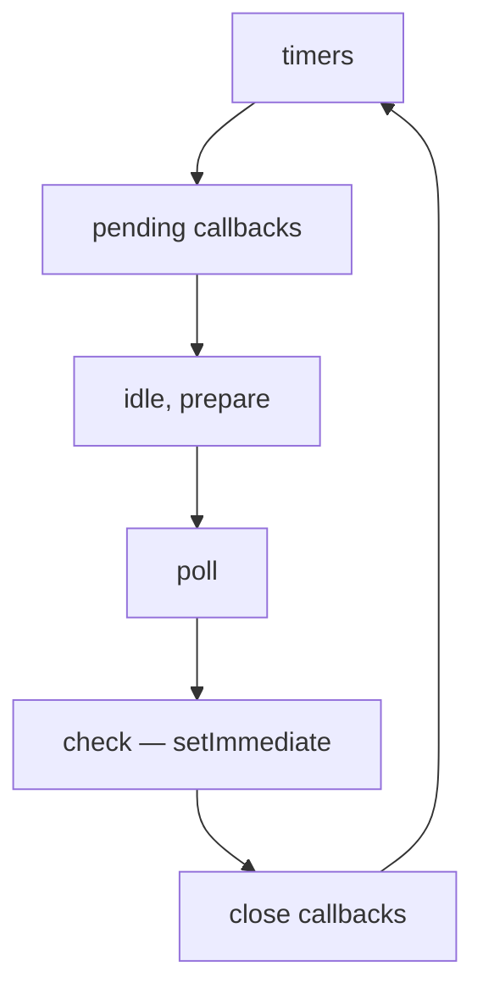
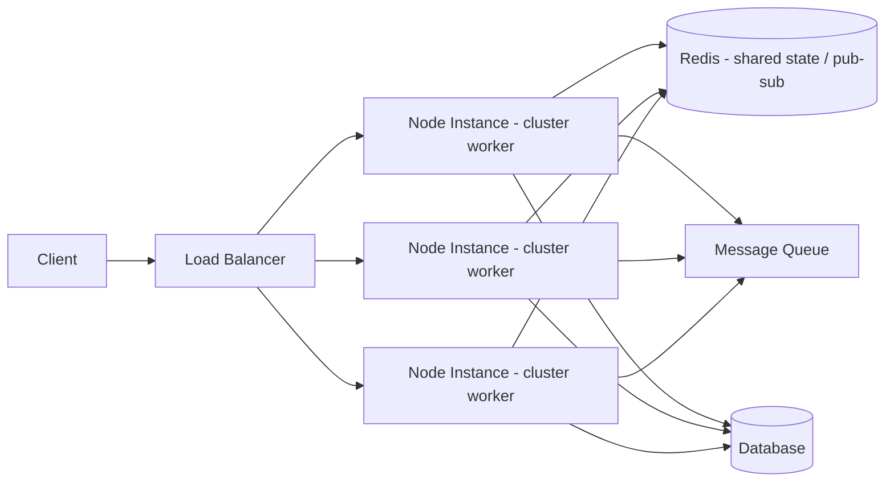

<!-- layout: title -->
<!-- backgroundImage: url('https://images.unsplash.com/photo-1558494949-ef010cbdcc31?w=1920&q=80&auto=format&fit=crop') dark -->

# Node.js Architecture

## What's actually happening under `node index.js` — for engineers who already ship it to production

<!-- notes -->

Set expectations: this isn't "what is Node.js" 101. It's the runtime internals that
explain the production incidents you've already debugged — event loop stalls,
mystery memory growth, cluster state bugs.

<!-- /notes -->

---

## Agenda

<!-- layout: bullets -->

- The runtime, layer by layer: V8, libuv, bindings, Node APIs
- The event loop — the real phase model, not the diagram everyone half-remembers
- Threads you didn't ask for: the libuv thread pool
- Microtasks vs macrotasks, and why ordering bugs happen
- V8 memory & GC — why senior engineers still get paged for this
- Streams and backpressure
- Scaling out: `cluster`, `worker_threads`, `child_process`
- Failure modes that only show up under load
- Observability: seeing the event loop from outside

<!-- notes -->

Nine sections, roughly two minutes each if we don't get pulled into Q&A early.

<!-- /notes -->

---

<!-- layout: statement -->

Node.js is a runtime, not a language — and almost every production incident traces back to one of its four layers.

---

## The Runtime, Layer by Layer

<!-- imagePosition: right -->

"JavaScript on the server" hides what matters: four distinct pieces wired together, each failing differently.

- **V8** — compiles and executes your JavaScript
- **libuv** — the async I/O engine: loop, thread pool, OS polling
- **Bindings (C++/N-API)** — glue between JS and syscalls
- **Node APIs** — `fs`, `http`, `net`, `crypto` built on the above


<!-- notes -->

Key point for seniors: V8 knows nothing about I/O. Every "async" thing Node does
is libuv (or a thread pool) doing work and handing V8 a callback to run.

<!-- /notes -->

---

## The Event Loop — the Real Phase Model



- **timers** — due `setTimeout`/`setInterval` callbacks
- **poll** — where the loop spends most of its time: I/O callbacks execute here
- **check** — `setImmediate` callbacks, guaranteed to run right after poll
- **close callbacks** — `socket.on('close', ...)` and friends

<!-- notes -->

Between every single callback, not just between phases, Node drains the
microtask queue. This is the part most diagrams leave out.

<!-- /notes -->

---

## Single-Threaded ≠ Single-Core

<!-- imagePosition: left -->


Your JS callbacks run on **one thread**. That's the whole claim — it does _not_ mean Node uses one CPU core, or that you get parallelism for free.

> [!IMPORTANT]
> A CPU-bound synchronous call — big `JSON.parse`, a heavy regex, sync crypto — blocks that thread and stalls every other request. The #1 cause of "Node fell over under load."

---

## libuv & the Thread Pool

libuv gives Node two different concurrency mechanisms, and mixing them up leads to wrong capacity planning:

- **OS-native async I/O** (epoll on Linux, kqueue on macOS, IOCP on Windows) for sockets — genuinely event-driven, no thread consumed per connection
- **A fixed-size thread pool** (default **4** threads, `UV_THREADPOOL_SIZE`) for operations the OS doesn't offer async primitives for: most `fs` calls, `dns.lookup`, and some `crypto` functions

<!-- slide -->

## Thread Pool Exhaustion

<!-- imagePosition: right -->

Those 4 threads are shared by every `fs`, `dns.lookup`, and `crypto` call in the process — there's no per-request isolation.


> [!WARNING]
> Heavy `fs` or `crypto.pbkdf2` usage under load can exhaust those 4 threads — every socket read/write is fine, but file and DNS operations start queuing behind each other.

---

## Microtasks vs Macrotasks

<!-- layout: code -->

```javascript
console.log('1: sync');

setTimeout(() => console.log('5: setTimeout (macrotask)'), 0);
setImmediate(() => console.log('6: setImmediate (macrotask)'));

Promise.resolve().then(() => console.log('3: promise (microtask)'));

process.nextTick(() => console.log('2: nextTick (microtask, highest priority)'));

queueMicrotask(() => console.log('4: queueMicrotask (microtask)'));

// Output order: 1, 2, 3, 4, 5, 6
// nextTick queue drains fully before the promise microtask queue,
// and BOTH drain completely before the loop moves to the next macrotask.
```

<!-- notes -->

This ordering is the source of a whole category of "why did this callback run
before/after that one" bug reports. Worth walking through live if there's time.

<!-- /notes -->

---

## V8: JIT Compilation & Memory

<!-- imagePosition: right -->

- **Ignition** — baseline interpreter, starts executing immediately
- **TurboFan** — optimizing JIT; recompiles hot functions, and **deoptimizes** them back if shapes change (polymorphism, `arguments` misuse)
- **Heap** — **new space** (frequent scavenge GC) vs **old space** (less frequent mark-sweep-compact)


> [!TIP]
> A latency spike that correlates with memory growth is often a GC pause, not your code — check `--trace-gc` first.

---

## Streams & Backpressure

<!-- layout: code -->

```javascript
const { pipeline } = require('node:stream/promises');
const fs = require('node:fs');
const zlib = require('node:zlib');

await pipeline(
  fs.createReadStream('access.log'),
  zlib.createGzip(),
  fs.createWriteStream('access.log.gz')
);
// pipeline() automatically respects backpressure: if the write stream
// can't keep up, the read stream is paused until the internal buffer drains.
// Manual .pipe() chains without error handling are the classic memory-leak source.
```

<!-- notes -->

Ask the room: who has debugged a memory leak that turned out to be an
unbounded stream buffer growing because the destination was slower than
the source? Almost always someone has.

<!-- /notes -->

---

## Scaling Out: Three Different Tools

<!-- columns: 3 -->
<!-- layout: bullets -->

### `cluster`

- Forks full processes
- Shares the listening **port** (round-robin)
- **No shared memory** — separate V8 heaps
- Use for: scaling I/O-bound HTTP across cores

::col::

<!-- layout: bullets -->

### `worker_threads`

- Threads within one process
- `SharedArrayBuffer` + `Atomics` for real shared memory
- Lower overhead than a process
- Use for: CPU-bound work (image processing, parsing)

::col::

<!-- layout: bullets -->

### `child_process`

- Fully separate process, separate binary
- Communicate via stdio/IPC only
- Use for: isolating untrusted code, calling other tools

---

## A Production Topology



<!-- align: center -->

Because `cluster` workers don't share memory, session state, rate limits, and pub-sub **must** live outside the process — Redis or an equivalent, not a module-level `Map`.

---

## Failure Modes That Only Show Up Under Load

<!-- layout: bullets -->

- **Blocking the event loop** — synchronous crypto, big JSON payloads, tight loops over large arrays
- **Unbounded in-memory caches** — a `Map` that grows forever because nothing ever evicts
- **Unhandled promise rejections** — silently swallowed errors until Node's default (crash) or a process manager masks it
- **Event listener leaks** — `EventEmitter` listeners added per-request and never removed
- **Thread pool starvation** — too much `fs`/`dns`/`crypto.pbkdf2` competing for 4 threads

> [!CAUTION]
> None of these show up in local dev or light load testing. They show up at 2 a.m. during a traffic spike.

---

## Observability: Seeing the Event Loop from Outside

<!-- imagePosition: right -->

- **Event loop lag** — `perf_hooks.monitorEventLoopDelay()`; alert on p99, not average
- **`--prof` / `--cpu-prof`** — V8 CPU profiles to find blocking functions
- **`--trace-gc`** — correlate latency spikes with GC pauses
- **Clinic.js / 0x** — flame graphs from real production traffic


---

<!-- layout: statement -->

If you can't see event loop lag in production, you don't actually know how healthy your Node service is.

---

## Key Takeaways

<!-- layout: bullets -->

- Node.js is four layers — V8, libuv, bindings, APIs — and most bugs live at the seam between two of them
- "Single-threaded" is about your JS callbacks, not about the whole runtime's concurrency
- Microtasks (`nextTick`, promises) always fully drain before the next macrotask — know this ordering cold
- `cluster` scales cores, `worker_threads` scales CPU-bound work with shared memory, `child_process` isolates — pick based on what you're actually bottlenecked on
- Backpressure-aware streams and eviction-aware caches are what separate "works in staging" from "survives production traffic"
- Instrument event loop lag before you need it, not after the incident

---

<!-- layout: title -->
<!-- backgroundImage: url('https://images.unsplash.com/photo-1451187580459-43490279c0fa?w=1920&q=80&auto=format&fit=crop') dark -->
<!-- titlePosition: center -->

# Thank You

## Questions?

<style>
  :root {
    --slide-font: 'Inter', 'Segoe UI', sans-serif;
    --slide-accent: #22d3ee;
    --slide-radius: 12px;
  }
</style>
