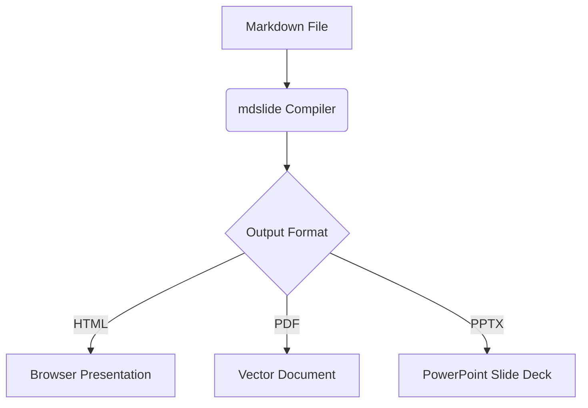

# Advanced Formatting (Math, Diagrams, GFM)

`mdslide` compiles advanced content elements like mathematical equations, structural diagrams, and GitHub Flavored Markdown (GFM) grids right out of the box.

---

## 1. Mathematical Equations (KaTeX)

You can write mathematical equations using LaTeX notation. The compiler uses KaTeX to render them into beautiful vector math layouts.

### Inline Math

Wrap LaTeX syntax in single dollar signs `$`:

```markdown
The Pythagorean theorem is $a^2 + b^2 = c^2$.
```

### Block Math

Wrap LaTeX syntax in double dollar signs `$$` on separate lines to render centered equations:

```latex
$$
f(x) = \int_{-\infty}^{\infty} e^{-x^2} dx
$$
```

---

## 2. Structural Diagrams (Mermaid)

You can draw flowcharts, state diagrams, sequence charts, and Gantt timelines directly inside your slides using `mermaid` fenced code blocks.

### Example Flowchart:

````markdown

````

---

## 3. GitHub Flavored Markdown (GFM)

Standard Markdown only supports basic lists and text blocks. `mdslide` includes full GFM support for creating rich tables, strikethrough text, and interactive task lists:

### Tables

Design styled data grids:

```markdown
| Feature     |  HTML  |  PDF   |       PPTX       |
| :---------- | :----: | :----: | :--------------: |
| Hot Reload  | ✅ Yes | ❌ No  |      ❌ No       |
| Offline Use | ✅ Yes | ✅ Yes |      ✅ Yes      |
| Vector Text | ✅ Yes | ✅ Yes | ⚠️ Editable Mode |
```

### Task Lists

Create checklist checkboxes:

```markdown
- [x] Integrate KaTeX parser
- [x] Configure Docusaurus site
- [ ] Add slide transitions
```

### Strikethrough

Cross out text:

```markdown
This feature is ~~deprecated~~ fully optimized in v1.0.
```

---

## 4. Admonitions / Callouts

`mdslide` reuses GitHub's own alert syntax directly: a blockquote whose first line is `[!KIND]`, where `KIND` (case-insensitive) is one of `note`, `tip`, `important`, `warning`, or `caution`.

```markdown
> [!TIP]
> Helpful advice for doing things better or more easily.
```

Instead of a plain blockquote, this renders as an icon + colored callout box. Each kind maps to its own icon and label:

| Kind        | Icon | Label         |
| :---------- | :--: | :------------ |
| `note`      |  📝  | **Note**      |
| `tip`       |  💡  | **Tip**       |
| `important` |  ❗  | **Important** |
| `warning`   |  ⚠️  | **Warning**   |
| `caution`   |  🔥  | **Caution**   |

There are no configuration options — the kind alone determines the styling. `mdslide validate` recognizes the `[!KIND]` marker and warns if `KIND` isn't one of the five recognized values (an unrecognized kind is otherwise silently rendered as a plain blockquote), and `mdslide inspect` lists every admonition kind detected on each slide — see [`validate`](../cli-commands/validate.md) and [`inspect`](../cli-commands/inspect.md).

---

## 5. Stats / Metric Grid

A fenced code block tagged with the `stats` language renders as a row of big-number metric cards instead of a code block. Write one `Label: value` pair per line, split on the first colon:

````markdown
```stats
Revenue: +34%
Deploys/wk: 12
NPS: 68
```
````

Blank lines are skipped, and any line without a colon (or with an empty label/value) is silently dropped. If none of the lines parse into a valid pair, the block falls back to rendering as a plain code block instead of an empty grid. There are no configuration options.

---

## 6. Chart From a Table

An HTML comment `<!-- chart: bar -->` (or `line` / `pie`) placed directly above a markdown table — with only the table itself following it, no other content in between — renders that table as an inline chart instead of a data grid. A blank line between the comment and the table is fine:

```markdown
<!-- chart: bar -->

| Month | Revenue |
| ----- | ------- |
| Jan   | 100     |
| Feb   | 180     |
| Mar   | 260     |
```

The table's first column becomes the category axis, and every remaining column becomes its own data series (shown with a legend for multi-series tables). A `pie` chart only uses the first value column, since a pie can only represent one series.

Like Mermaid diagrams, charts are rendered server-side as inline SVG rather than with client-side JS/canvas — this keeps them pixel-perfect across the headless-Chrome screenshot, PDF, and PPTX-screenshot export paths, with nothing left for a browser to draw at export time.

The `--pptx-mode editable` export goes a step further for charts specifically: instead of screenshotting the rendered SVG, it rebuilds the same table data as a **native, editable PowerPoint chart object** (via pptxgenjs's `addChart`), so the chart can be restyled or have its data tweaked directly inside PowerPoint after export.

`mdslide validate` checks that the `chart:` directive's value is one of `bar`, `line`, or `pie` and that it's immediately followed by a table, and `mdslide inspect` reports the detected chart kind for each slide — see [`validate`](../cli-commands/validate.md) and [`inspect`](../cli-commands/inspect.md).

---

## 7. Video / GIF Embeds

Ordinary image syntax pointing at a `.mp4` or `.webm` file automatically renders as an autoplaying, looping, muted `<video>` element instead of a broken `` — no special syntax needed:

```markdown

```

`.gif` URLs are deliberately **not** converted to `<video>` — this is a design choice, not an oversight. Animated GIFs already autoplay and loop correctly as a plain ``, and browsers can't play a `.gif` file inside a `<video>` tag anyway, so `` keeps rendering as an `` exactly as before.

`mdslide inspect` reports `hasVideo: true` on any slide where a video embed is detected — see [`inspect`](../cli-commands/inspect.md).
