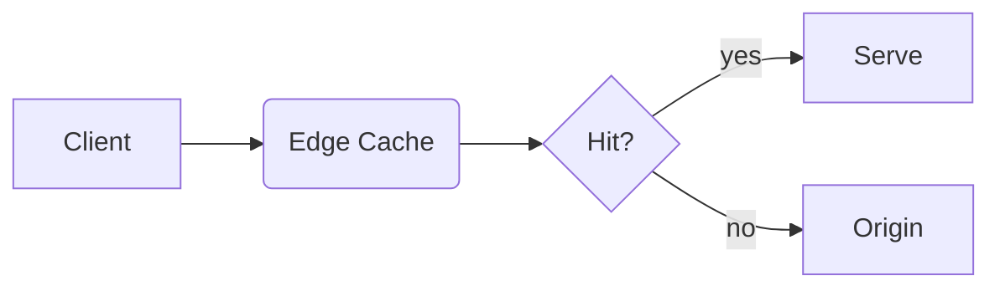

# mdslide — Complete Syntax & CLI Reference

> This is the canonical, self-contained reference for authoring and building
> presentations with `mdslide`. It is written so that a human — or an AI agent
> with no other context — can create, update, and export a full slide deck
> from scratch. Print it any time with `mdslide llms`.

`mdslide` compiles a single standard Markdown (`.md`) file into an interactive
slide deck exported as **HTML**, **PDF**, or **PowerPoint (PPTX)**. You never
touch a GUI: author Markdown, run the CLI.

---

## Recommended Workflow (for AI agents)

1. **Write** a `slides.md` file using the syntax below.
2. **Validate**: `mdslide validate slides.md --json` — run `--fix` first to
   auto-repair mechanical issues (unclosed fences/notes), then fix any
   remaining overflow or annotation warnings before delivering. Each issue
   reports a `line` and, for overflow, exactly how many pixels/blocks are
   over budget — no need to guess-and-check.
3. **Sanity-check the structure (optional but recommended)**:
   `mdslide inspect slides.md --json` — confirms which layout each slide
   resolved to and why, without a full render, catching cases where an
   auto-detected layout wasn't the one intended.
4. **Preview or export**:
   - Live preview with hot-reload: `mdslide watch slides.md --port 3500 --open`
   - Standalone HTML: `mdslide compile slides.md -o deck.html`
   - PDF: `mdslide compile slides.md -o deck.pdf`
   - PowerPoint: `mdslide compile slides.md -o deck.pptx --pptx-mode editable`
5. **Visually verify (recommended for agents without a browser)**:
   `mdslide screenshot slides.md --json` — renders each slide to a PNG file
   and reports their paths, so an agent can view the actual rendered output
   (layout, overflow, image placement) instead of only inspecting structure.
6. **Update**: edit the Markdown file, re-run `validate`, recompile. If a
   `watch` server is running with `--json`, each save emits an
   `{"event":"recompile",...}` line reporting success/failure — no restart
   needed.

Avoid running bare `mdslide slides.md` in automated contexts: it launches an
interactive wizard that requires a human at the keyboard. Always use the
explicit `compile` / `watch` / `validate` subcommands with flags.

---

## 1. Presentation File Structure

A presentation is one Markdown file with three kinds of building blocks:

```markdown
---
title: My Deck # ← 1. YAML frontmatter: global defaults (optional)
theme: gradient
---

<!-- layout: title -->    # ← 3. HTML comment annotations: per-slide overrides

# First Slide

--- # ← 2. Slide separator: `---` on its own empty line

## Second Slide

- Content here
```

### Slide separation

- **`<!-- slide -->` (recommended for AI agents)**: this marker always starts
  a new slide, on its own line with a blank line before and after it,
  regardless of heading structure elsewhere in the file. Unlike `---`/`##`
  auto-detection (below), its meaning never depends on what else is in the
  document — the safest choice when generating one slide at a time.
- **Explicit**: three dashes `---` on an empty line start a new slide.
- **Auto-separation**: if the file contains no `---` dividers and no
  `<!-- slide -->` markers, the compiler automatically starts a new slide at
  every Level-2 heading (`##`).

`---`, `<!-- slide -->`, and `##` markers can all be mixed in one file; either
explicit form (`---` or `<!-- slide -->`) always takes precedence over the
`##` heuristic wherever it appears in the document.

---

## 2. Global Frontmatter (applies to all slides)

Optional YAML block between `---` boundaries at the very top of the file:

```yaml
---
title: Product Kickoff 2026
theme: gradient
titleAlign: center
titlePosition: top
animation: slide-up
overflow: split
---
```

| YAML Key                 | Allowed Values                                                              | Description                                                        |
| :----------------------- | :-------------------------------------------------------------------------- | :----------------------------------------------------------------- |
| `title`                  | Any text                                                                    | Presentation title (used in compiled HTML metadata).               |
| `theme`                  | `light`, `dark`, `notion`, `terminal`, `gradient`, `corporate`, `solarized` | Overall visual theme and color scheme. Global only.                |
| `titleAlign`             | `left`, `center`, `right`                                                   | Default horizontal alignment for slide titles.                     |
| `titlePosition`          | `top`, `center`, `bottom`                                                   | Default vertical position for slide titles.                        |
| `animation` (or `build`) | `fade`, `slide-up`, `slide-left`, `slide-right`, `zoom`                     | Default step-by-step reveal animation for list items and images.   |
| `fontSize`               | `xs`, `sm`, `md`, `lg`, `xl`, `xxl`                                         | Default typography scale for all slides.                           |
| `overflow`               | `split`, `none`                                                             | Enables/disables the auto-splitting engine for overflowing slides. |

Frontmatter values are **defaults**; any slide can override them locally with
a comment annotation (below). The slide-level value always wins for that slide.

---

## 3. Per-Slide Comment Annotations

Place standard HTML comments inside a slide (typically near the top) to
override settings for that slide only:

```markdown
# Target Metrics

<!-- titleAlign: center -->
<!-- animation: zoom -->

- Metric A
- Metric B
```

| Annotation                           | Allowed Values                                                                          | Description                                                                             |
| :----------------------------------- | :-------------------------------------------------------------------------------------- | :-------------------------------------------------------------------------------------- |
| `<!-- layout: value -->`             | `title`, `bullets`, `content`, `code`, `visual`, `table`, `quote`, `statement`, `split` | Force a specific layout for this slide.                                                 |
| `<!-- titleAlign: value -->`         | `left`, `center`, `right`                                                               | Horizontal title alignment for this slide.                                              |
| `<!-- titlePosition: value -->`      | `top`, `center`, `bottom`                                                               | Vertical title placement for this slide.                                                |
| `<!-- align: value -->`              | `top`, `center`, `bottom`                                                               | Vertical alignment of the body content itself, independent of the title (see below).    |
| `<!-- columns: N ratio:a:b:c -->`    | `N` = column count (informational/validated); `ratio` optional                          | Declares the expected column count and relative widths for an `::col::` split (see §4). |
| `<!-- animation: value -->`          | `fade`, `slide-up`, `slide-left`, `slide-right`, `zoom`                                 | Reveal animation for this slide's list items/elements.                                  |
| `<!-- fontSize: value -->`           | `xs`, `sm`, `md`, `lg`, `xl`, `xxl`                                                     | Typography scale for this slide only.                                                   |
| `<!-- overflow: value -->`           | `split`, `none`                                                                         | Enable/disable auto-splitting for this slide only.                                      |
| `<!-- backgroundImage: ... -->`      | `url('...')` optionally followed by `dark` or `light`                                   | Full-bleed background image (see §5).                                                   |
| `<!-- imageFit: value -->`           | `contain`, `cover`                                                                      | Overrides `object-fit` for every image/video on this slide (see §7).                    |
| `<!-- imagePosition: value -->`      | `left`, `right`                                                                         | Which side the image sits on in the auto-detected image+text split layout (see §7).     |
| `<!-- accentColor: value -->`        | Any CSS color (e.g. `#f43f5e`, `rgb(...)`, a keyword)                                   | Overrides the theme's accent color for this slide only (see §7).                        |
| `<!-- notes --> ... <!-- /notes -->` | Any text between the markers                                                            | Speaker notes shown only in Presenter View (see §6).                                    |

`<!-- layout: value -->` can also be placed **inside** a specific `::col::`/
`::split::` column's own segment to override just that column's layout
(valid values there exclude `title`/`split`) — see "Per-column layout
override" in §4.

`align` is independent of `titlePosition`: `titlePosition` moves the title +
content block together as a group, while `align` only controls how the body
content packs within its own space (useful for a short slide that shouldn't
glue to the top even while the title stays there):

```markdown
# One Thing to Remember

<!-- align: center -->

Ship small, ship often.
```

Without `<!-- align: center -->` here, the single short line would sit glued
to the top of the slide (below the title) instead of centered in the
remaining space.

---

## 4. Slide Layouts

The layout engine auto-detects a fitting layout from content, but you can
force one with `<!-- layout: name -->`:

| Layout      | Use case                       | Style                                                     |
| :---------- | :----------------------------- | :-------------------------------------------------------- |
| `title`     | Cover slide, section headers   | Title + subtitle centered, extra-large fonts.             |
| `bullets`   | Bulleted summaries             | Larger list typography, accent markers, generous margins. |
| `content`   | General mixed content          | Default flowing layout: heading plus paragraphs/blocks.   |
| `code`      | Full-screen source code        | Code block fills the slide, optimized typography.         |
| `visual`    | Prominent images/screenshots   | Image stretched to maximum area, heading kept neat.       |
| `quote`     | Testimonials, key takeaways    | Quote centered in a highlighted glassmorphic card.        |
| `table`     | Comparison grids               | Table centered vertically and horizontally.               |
| `statement` | One big statistic or statement | Single short sentence in a massive font.                  |
| `split`     | Two-column comparisons         | Side-by-side columns (pairs with `::split::`, see below). |

### Layout examples

```markdown
<!-- layout: title -->

# My Presentation Title

## A compelling subtitle
```

```markdown
<!-- layout: quote -->

> "Make it work, make it right, make it fast."
>
> - Kent Beck
```

```markdown
<!-- layout: statement -->

10× faster than traditional tools.
```

### Two-column splits (`::split::`)

Partition any slide into two equal columns by placing `::split::` alone on an
empty line (blank lines before AND after it are required — otherwise it is
treated as body text and ignored):

```markdown
# Front-end vs Back-end

### Front-end

- React / Next.js
- Tailwind CSS

::split::

### Back-end

- Node.js / Bun
- PostgreSQL / Redis
```

### N-column splits (`::col::`)

For more than two columns, place `<!-- columns: N -->` near the top of the
slide and separate each column's content with `::col::` (also alone on an
empty line, blank lines required before and after). This produces `N`
equal-width columns — one more column than the number of `::col::` markers:

```markdown
# Frontend vs Backend vs Infra

<!-- columns: 3 -->

### Frontend

- React / Next.js

::col::

### Backend

- Node.js / Bun

::col::

### Infra

- Terraform
- Kubernetes
```

Add `ratio:a:b:c` (one weight per column, colon-separated) to the same
comment for unequal widths, e.g. a wide left column and two narrow ones:

```markdown
<!-- columns: 3 ratio:2:1:1 -->
```

The `columns: N` count and the ratio's segment count are both validated
against the actual number of `::col::`-delimited columns — `mdslide validate`
warns (and the compiler falls back to equal-width columns) if they don't
match, so getting the count right isn't strictly required, just recommended
for clarity. `::split::` (above) remains the shorthand for the common
two-column case and behaves exactly as before; `::col::` is required for
anything beyond two columns.

### Per-column layout override

Each column resolves its own layout independently (bullets/code/quote/table/
statement/content/visual), auto-detected from that column's own content just
like a whole slide would be. Place a `<!-- layout: xxx -->` comment inside a
specific column's segment (after its `::col::`/`::split::` marker, before the
next one) to force that one column's layout without affecting its siblings:

```markdown
# Build vs Test vs Deploy

<!-- columns: 3 ratio:2:1:1 -->
<!-- layout: code -->

\`\`\`bash
npm run build
\`\`\`

::col::

- Smoke tests
- Integration tests

::col::

Deploy stuff, no special layout here.
```

Here the first column is forced to render with `code` styling (bordered,
shadowed code block) regardless of what it would auto-detect to, the second
auto-detects `bullets` (it has a list), and the third auto-detects `content`
(plain flowing text) — all three sit in the same `::col::` row. Valid values
are the same set as the whole-slide `<!-- layout: -->` override, minus
`title` and `split` (a column can't be its own title slide, and splits can't
nest). `mdslide validate`/`mdslide inspect` both understand per-column
overrides: `validate` warns on an invalid value or more than one comment in
the same column, and `inspect` lists each column's resolved layout.

### Auto-split heuristic (text + image)

If a slide contains **exactly one image** plus text and no manual `::split::`,
the compiler automatically renders a two-column layout: text on the left,
image fitted on the right. To avoid this, force a layout explicitly.

Note: `<!-- layout: split -->` is normally redundant — a `::split::` marker or
the one-image heuristic already selects the split layout. Forcing it on a
slide with neither simply renders the content in normal flow.

---

## 5. Background Images

```markdown
# Skyrocket Sales

<!-- backgroundImage: url('https://example.com/growth.jpg') -->
```

- **Luminance auto-detection**: dark images flip slide text to white; light
  images keep dark text with subtle drop shadows.
- **Manual override**: append `dark` or `light` inside the comment to force
  the contrast theme:

```markdown
<!-- backgroundImage: url('dark-forest.jpg') dark -->
<!-- backgroundImage: url('snowy-mountain.jpg') light -->
```

---

## 6. Speaker Notes

Text between `<!-- notes -->` and `<!-- /notes -->` is hidden from the main
presentation and shown only in the Presenter View window (opened with `P`),
alongside a presentation timer:

```markdown
# Q3 Financial Summary

- Revenue up 15%
- Net profit up 8%

<!-- notes -->

Emphasize that profit growth came from the new licensing model.
Expect questions about marketing costs.

<!-- /notes -->
```

---

## 7. Advanced Content (Math, Diagrams, GFM)

All supported out of the box — no plugins or configuration:

- **Inline math (KaTeX)**: `The theorem is $a^2 + b^2 = c^2$.`
- **Block math**: wrap LaTeX in `$$ ... $$` on separate lines for a centered
  equation.
- **Mermaid diagrams**: fenced code block with the `mermaid` language tag —
  flowcharts, sequence diagrams, state charts, Gantt timelines:

  ````markdown
  ```mermaid
  graph TD
      A[Markdown File] --> B(mdslide Compiler)
      B --> C{Output Format}
  ```
  ````

- **GitHub Flavored Markdown**: tables (`| a | b |`), task lists (`- [x]`),
  and strikethrough (`~~text~~`).

### Admonitions / callouts

A blockquote whose first line is `[!KIND]` (GitHub's own alert syntax — `note`,
`tip`, `important`, `warning`, `caution`, case-insensitive) renders as an icon

- colored callout box instead of a plain blockquote:

```markdown
> [!TIP]
> Helpful advice for doing things better or more easily.
```

### Stats / metric grid

A fenced code block with the `stats` language tag, containing one
`Label: value` pair per line, renders as a row of big-number metric cards:

````markdown
```stats
Revenue: +34%
Deploys/wk: 12
NPS: 68
```
````

### Chart from a table

`<!-- chart: bar -->` (or `line` / `pie`), placed immediately above a
markdown table with no blank line in between, renders that table as an
inline chart instead of a grid. The table's first column is the category
axis; any additional columns become separate chart series (a `pie` chart
uses only the first value column):

```markdown
<!-- chart: bar -->

| Month | Revenue |
| ----- | ------- |
| Jan   | 100     |
| Feb   | 180     |
| Mar   | 260     |
```

### Image fit & position

`<!-- imageFit: contain|cover -->` overrides how every image/video on that
slide is scaled within its box (default depends on layout — e.g. `contain` in
a `visual` slide, `cover` for grid thumbnails extracted from a list):

```markdown
<!-- imageFit: cover -->


```

`<!-- imagePosition: left|right -->` controls which side the image sits on in
the **auto-detected** image+text split layout (exactly one image alongside
meaningful text, with no manual `::split::`/`::col::` markers). Default is
`right` (text left, image right):

```markdown
<!-- imagePosition: left -->

The product does X, Y, and Z, and here's what it looks like in action.


```

Manual `::split::`/`::col::` layouts and the centered `visual` layout are
unaffected — you already control column order via source order in those.

### Video / GIF embed

Ordinary image syntax pointing at a `.mp4` or `.webm` file renders as an
autoplaying, looping, muted `<video>` instead of a broken `` — handy for
embedding a short product demo clip directly in a slide:

```markdown

```

`.gif` URLs are **not** converted — animated GIFs already autoplay/loop
correctly as a plain ``, and browsers can't play a `.gif` inside a
`<video>` tag anyway, so `` keeps working exactly as before.

### Per-slide accent color

`<!-- accentColor: #f43f5e -->` overrides the theme's accent color (list
markers, links, borders, chart palette, etc.) for just this one slide,
without touching the global theme or any other slide:

```markdown
<!-- accentColor: #f43f5e -->

- This slide gets its own rose accent color
- Every other slide keeps the deck's theme color
```

Accepts any CSS color (hex, `rgb()`/`hsl()`, or a keyword). The editable-PPTX
export applies the same override to that slide's shapes, but only for plain
hex colors — pptxgenjs can't represent `rgb()`/named colors natively, so a
non-hex value there is a silent no-op (the HTML/screenshot/PDF paths always
honor it in full).

---

## 8. Custom Styling (CSS Variables)

Add a `<style>` block (conventionally at the bottom of the file) and override
CSS variables on `:root`:

```html
<style>
  @import url('https://fonts.googleapis.com/css2?family=Outfit:wght@400;700&display=swap');

  :root {
    --slide-font: 'Outfit', sans-serif; /* main font family */
    --slide-mono: 'Fira Code', monospace; /* code font family */
    --slide-bg: #0f172a; /* slide background */
    --slide-text: #f8fafc; /* body text and headings */
    --slide-accent: #f43f5e; /* links, bullet markers, borders */
    --slide-radius: 10px; /* card/code/image border radius */
  }
</style>
```

| Variable          | Purpose                                                   |
| :---------------- | :-------------------------------------------------------- |
| `--slide-font`    | Main font family (headings, lists, paragraphs, cards).    |
| `--slide-mono`    | Font family for code blocks and inline code.              |
| `--title-size`    | Primary slide title size (default `3.6rem`).              |
| `--h2-size`       | Secondary heading size (default `2.6rem`).                |
| `--h3-size`       | Tertiary heading size (default `1.8rem`).                 |
| `--body-size`     | Paragraph text size (default `1.35rem`).                  |
| `--li-size`       | List item size (default `1.3rem`).                        |
| `--code-size`     | Code block font size (default `1.1rem`).                  |
| `--slide-bg`      | Slide background color.                                   |
| `--slide-surface` | Background for quote boxes, code blocks, cards.           |
| `--slide-text`    | Main body text and heading color.                         |
| `--slide-muted`   | Footnotes, captions, muted elements.                      |
| `--slide-accent`  | Accent color: link underlines, bullet markers, borders.   |
| `--slide-border`  | Divider lines and card borders.                           |
| `--slide-radius`  | Border radius for cards, code containers, images (`6px`). |

---

## 9. CLI Command Reference

### Discovering commands and flags at runtime

The tables below document every command and flag, but the CLI itself is
always the authoritative source for the **installed** version. To
self-discover at runtime:

```bash
mdslide --help              # list all commands
mdslide compile --help      # full flag reference for one command
mdslide watch --help        # (works for every subcommand: compile, watch,
mdslide validate --help     #  validate, inspect, screenshot, init, interactive)
mdslide inspect --help
mdslide screenshot --help
mdslide --version           # installed CLI version
mdslide llms                # reprint this entire reference
```

If a flag in this document is rejected by the CLI, or you need an option not
listed here, run `mdslide <command> --help` and trust that output — it always
matches the binary you are running.

### Global flags (accepted by every command)

| Flag             | Default | Description                                                                                          |
| :--------------- | :------ | :--------------------------------------------------------------------------------------------------- |
| `--json`         | `false` | Print one machine-readable JSON object to stdout; human logs are silenced. Exit codes are unchanged. |
| `--no-input`     | `false` | Never prompt. Skips the interactive wizard everywhere and uses defaults + explicit flags.            |
| `--yes`          | `false` | Auto-accept every interactive prompt with its default answer (wizard runs hands-free).               |
| `--dry-run`      | `false` | Full compile/validation runs, but nothing is written, opened, or served.                             |
| `--timeout <ms>` | none    | Abort the whole command after `<ms>` milliseconds with **exit code 124**.                            |

The recommended invocation for automated tools is:

```bash
mdslide compile slides.md --no-input --json --timeout 60000
```

- `--json` error shape (any command, any failure): `{ "success": false, "error": "...", "code": "ERR_*", "hint": "..." }`. See [Error codes](#error-codes) for the full list of `code` values.
- `compile --json` success shape: `{ "file", "output", "format", "slides", "warnings": [], "dryRun", "written", "success" }`.
- `init --json` shape: `{ "success", "dryRun", "created": [], "skipped": [], "scriptsAdded" }`.
- `watch --json` prints `{ "success", "url", "port", "watching" }` once the server is up, then keeps emitting one compact `{"event":"recompile",...}` line per save — the whole stream is [NDJSON](https://github.com/ndjson/ndjson-spec) (combine with `--timeout` for bounded runs).
- `--dry-run` with `compile` still surfaces every compiler error and warning, so `compile --dry-run --strict` is a deeper check than `validate` alone.
- In auto mode (`--yes` / `--no-input`) the wizard picks `html` format, `light` theme, `output.html`, no watch server, and never opens a browser.
- Pass `-` as `<input>` on `compile`, `validate`, `inspect`, or `screenshot` to read the Markdown from stdin; pass `-o -` / `--output -` to `compile` to stream the compiled HTML to stdout instead of writing a file (html format only). `watch` always needs a real file to watch and rejects `-`.

### Error codes

Every thrown error carries a stable `code` in its `--json` error shape and in
the human `(code)` label next to its name. Match on `code`, not on the
message text, which may be reworded between versions.

| Code                     | Meaning                                                                         | Remedy                                                                                                 |
| :----------------------- | :------------------------------------------------------------------------------ | :----------------------------------------------------------------------------------------------------- |
| `ERR_INPUT_NOT_FOUND`    | The input file path does not exist.                                             | Check the path, or pass `-` to read from stdin.                                                        |
| `ERR_INVALID_FORMAT`     | `--format`/`-f` was not one of `html`, `pdf`, `pptx`.                           | Use a supported format, or let it auto-detect from `-o`'s extension.                                   |
| `ERR_CHROME_NOT_FOUND`   | PDF, PPTX-screenshot, or `screenshot` export needs Chrome/Chromium, none found. | Install Chrome/Chromium, or set the `CHROME_PATH` env var.                                             |
| `ERR_PORT_IN_USE`        | Every port in the scan range starting at the requested one is busy.             | Pass a different `--port`.                                                                             |
| `ERR_COMPILE`            | The Markdown failed to compile (parser/renderer error).                         | Fix the reported Markdown issue; run `validate` for a full diagnosis.                                  |
| `ERR_VALIDATION_FAILED`  | `validate` found errors, or warnings with `--strict`.                           | Fix the reported issues, or drop `--strict` to allow warnings.                                         |
| `ERR_STDOUT_OUTPUT`      | An unsupported combination was requested with stdout piping.                    | Only `--format html` can stream to `-o -`; don't combine `--json` with `-o -` (both want stdout).      |
| `ERR_STDIN_UNSUPPORTED`  | Stdin (`-`) was used somewhere it can't work.                                   | `watch` needs a real file to watch; `validate --fix` needs a real file to write the fix back to.       |
| `ERR_INVALID_TIMEOUT`    | `--timeout` was not a positive number of milliseconds.                          | Pass a positive integer, e.g. `--timeout 60000`.                                                       |
| `ERR_TIMEOUT`            | The command ran longer than `--timeout` allowed (exit code 124).                | Increase `--timeout`, or investigate what is hanging.                                                  |
| `ERR_INVALID_ASSET_URLS` | `--asset-urls` was not valid JSON, or not a JSON object.                        | Pass a JSON object mapping asset keys to URLs, e.g. `--asset-urls '{"katexCss":"/vendor/katex.css"}'`. |

### `mdslide compile <input> [options]` — build a distributable file

| Flag                     | Short | Default             | Description                                                                                                  |
| :----------------------- | :---- | :------------------ | :----------------------------------------------------------------------------------------------------------- |
| `--theme <theme>`        | `-t`  | `light`             | `light`, `dark`, `notion`, `terminal`, `gradient`, `corporate`, `solarized`                                  |
| `--output <file>`        | `-o`  | `output.<format>`   | Output file path.                                                                                            |
| `--format <format>`      | `-f`  | auto from extension | `html`, `pdf`, or `pptx`.                                                                                    |
| `--pptx-mode <mode>`     |       | `screenshot`        | `screenshot` (pixel-perfect images) or `editable` (native PPTX shapes).                                      |
| `--asset-urls <json>`    |       | built-in CDNs       | JSON object overriding Prism/KaTeX/Mermaid CDN URLs, e.g. to self-host for offline/CSP-restricted embedding. |
| `--open`                 |       | `false`             | Open the compiled file when done.                                                                            |
| `--strict`               |       | `false`             | Exit with an error code if validation warnings are found.                                                    |
| `--verbose` / `--silent` |       | `false`             | More / no console output.                                                                                    |

Notes:

- PDF and PPTX-screenshot exports require a local Chrome/Chromium install
  (headless browser rendering). A custom binary path can be set via
  `pdf.chromePath` in the config file.
- `--pptx-mode screenshot` preserves exact visual styling as images;
  `--pptx-mode editable` produces native, editable PowerPoint text/shapes.
- **Piping**: `<input>` accepts `-` to read Markdown from stdin; `-o -` /
  `--output -` streams the compiled file to stdout instead of writing it to
  disk (html format only — pdf/pptx need a real file target for Chrome/the
  PPTX writer, and reject `-o -` with `ERR_STDOUT_OUTPUT`). Don't combine
  `-o -` with `--json`: both want to own stdout.

  ```bash
  cat slides.md | mdslide compile - -o - -f html > deck.html
  ```

### `mdslide watch <input> [options]` — live dev server with hot-reload

| Flag              | Short | Default | Description                    |
| :---------------- | :---- | :------ | :----------------------------- |
| `--port <port>`   | `-p`  | `3500`  | Dev server port.               |
| `--theme <theme>` | `-t`  | config  | Theme override during preview. |
| `--open`          |       | `false` | Open the browser on startup.   |

Saving the Markdown file recompiles and refreshes the browser automatically
via WebSocket — no restart needed between edits. `watch` always needs a real
file on disk (stdin input is rejected with `ERR_STDIN_UNSUPPORTED`).

With `--json`, every recompile triggered by a save prints one compact line to
stdout in addition to the startup line, so a supervising agent can tell what
each edit did without polling:

```json
{"event":"recompile","success":true,"slides":5,"warnings":[]}
{"event":"recompile","success":false,"error":"Unclosed code fence.","code":"ERR_COMPILE"}
```

### `mdslide validate <input> [options]` — lint the deck

Checks frontmatter key/value validity, comment-annotation syntax (including
per-column `<!-- layout: -->` overrides, `> [!KIND]` admonition markers,
`<!-- chart: bar|line|pie -->` directives, and
`<!-- imageFit: -->`/`<!-- imagePosition: -->`/`<!-- accentColor: -->`
values), layout compatibility (e.g.
splitting a `title` slide), and **visual overflow**
(content exceeding slide height, estimated with the same per-node height
model the compiler's auto-split engine uses — not a line-count guess). Use
`--strict` to turn warnings into a non-zero exit code. Always run this after
writing or updating a deck. Accepts `-` as `<input>` to validate Markdown
from stdin (not combinable with `--fix`, since there's no file to write back to).

**Machine-readable mode**: pass `--json` to print a single JSON object to
stdout instead of the human-formatted report (exit codes are unchanged —
`0` clean or warnings-only, `1` errors, or any warnings with `--strict`):

```bash
mdslide validate slides.md --json
```

````json
{
  "file": "/abs/path/slides.md",
  "valid": false,
  "slides": 3,
  "errors": 1,
  "warnings": 1,
  "issues": [
    {
      "type": "error",
      "slide": 3,
      "line": 42,
      "message": "Unclosed code fence (```).",
      "hint": "Make sure every opening ``` has a matching closing ```.",
      "fixable": true
    },
    {
      "type": "warning",
      "slide": 3,
      "line": 12,
      "message": "Slide content is ~180px over the visible slide height (~830px of a ~650px budget) - may overflow in the browser.",
      "hint": "Move or trim the last 2 blocks to a new slide, or add \"<!-- overflow: split -->\" to auto-continue."
    }
  ]
}
````

Every issue includes a 1-based `line` when it can be located precisely in
the source file, in addition to its `slide` number — fix by line, don't
guess-and-check. Issues carry `"fixable": true` when `--fix` (below) can
repair them automatically; the field is omitted otherwise.

**Auto-fix mode**: pass `--fix` to repair mechanical, unambiguous issues in
place before reporting — an unclosed code fence or notes block is closed, a
stray closing `<!-- /notes -->` tag with no matching open is removed. The
file is only rewritten if something was actually fixed. Issues that require
guessing intent (invalid layout overrides, nested notes, multiple layout
overrides) are left for a human/agent to resolve and still show up in the
report. In `--json` mode, applied fixes are listed under a `fixed` array
(present only when `--fix` was passed):

```bash
mdslide validate slides.md --fix --json
```

```json
{
  "file": "...",
  "valid": true,
  "slides": 3,
  "errors": 0,
  "warnings": 0,
  "issues": [],
  "fixed": ["Closed an unclosed code fence."]
}
```

**Output encoding**: all CLI output is plain text without ANSI color codes
whenever stdout is not a TTY (piped/captured) or the `NO_COLOR` environment
variable is set, so captured output never needs escape-code stripping. Set
`FORCE_COLOR=1` to override.

### `mdslide inspect <input> [options]` — dump the parsed slide structure

Compiles the deck and reports, per slide, without rendering or opening
anything: the resolved layout and **why** it was chosen (explicit override,
or which auto-detection rule matched — and whether an auto-detected
two-column/image layout silently superseded an explicit override), a count
of every element type in the slide's content tree, and the estimated content
height against the visible slide budget. Use this to confirm the compiler
did what you intended before spending a full `compile`/render cycle. Accepts
`-` as `<input>` to inspect Markdown from stdin.

```bash
mdslide inspect slides.md --json
```

```json
{
  "file": "/abs/path/slides.md",
  "slides": 2,
  "meta": { "theme": "gradient" },
  "warnings": [],
  "deck": [
    {
      "index": 1,
      "id": "…",
      "title": "Agenda",
      "layout": "bullets",
      "layoutSource": "auto",
      "layoutReason": "Auto-detected. Contains a list, so it uses the bulleted-summary layout.",
      "elementCounts": { "list": 1, "listItem": 3, "paragraph": 3, "text": 3 },
      "contentHeightPx": 135,
      "maxHeightPx": 650,
      "overflowing": false,
      "hasNotes": false
    }
  ]
}
```

For a `split` slide, each entry also carries a `columns` array (one
`{ "layout": "..." }` per column, in order) reflecting each column's own
resolved layout, including any per-column `<!-- layout: -->` override. A
slide containing an admonition and/or a chart table also carries
`admonitions`/`charts` arrays (kinds found, in document order) — omitted
entirely when the slide has none of either. A slide with an `imageFit`,
`imagePosition`, or `accentColor` override reports that value under the
matching field name, and a slide containing a `.mp4`/`.webm` video reports
`"hasVideo": true` — all four fields are omitted when not applicable.

Without `--json`, the same information prints as a readable per-slide report.

### `mdslide screenshot <input> [options]` — render slides to PNG images

Compiles the deck and renders each slide to a standalone PNG using headless
Chrome/Chromium — the same capture pipeline `--pptx-mode screenshot` uses,
exposed directly as files instead of embedding them in a PPTX. This is the
recommended way for an AI agent (which cannot open a browser) to visually
confirm what a deck actually looks like: layout choices, overflow, image
placement, theme colors.

| Flag                     | Short | Default         | Description                                                                 |
| :----------------------- | :---- | :-------------- | :-------------------------------------------------------------------------- |
| `--theme <theme>`        | `-t`  | `light`         | `light`, `dark`, `notion`, `terminal`, `gradient`, `corporate`, `solarized` |
| `--output <dir>`         | `-o`  | `./screenshots` | Output directory for the PNG files.                                         |
| `--slide <n>`            |       | every slide     | Capture only slide `<n>` (1-based) instead of the whole deck.               |
| `--width <px>`           |       | `1920`          | Viewport width used for the capture.                                        |
| `--height <px>`          |       | `1080`          | Viewport height used for the capture.                                       |
| `--verbose` / `--silent` |       | `false`         | More / no console output.                                                   |

Files are named `slide-<n>.png` (1-based), matching `<!-- layout -->`/slide
order. Requires a local Chrome/Chromium install, same as PDF/PPTX-screenshot
export (`ERR_CHROME_NOT_FOUND` if none is found). Accepts `-` as `<input>` to
screenshot Markdown from stdin.

```bash
mdslide screenshot slides.md --json
```

```json
{
  "file": "/abs/path/slides.md",
  "outputDir": "/abs/path/screenshots",
  "slides": 3,
  "screenshots": [
    "/abs/path/screenshots/slide-1.png",
    "/abs/path/screenshots/slide-2.png",
    "/abs/path/screenshots/slide-3.png"
  ],
  "warnings": [],
  "dryRun": false,
  "success": true
}
```

After running this, an agent should read the PNG files at the paths in
`screenshots` directly to see the rendered slides.

### `mdslide init [--force]` — scaffold a project

Creates an annotated sample `slides.md` (demonstrating layouts, animations,
split columns, math, code) and an `mdslide.config.ts` config file. `--force`
overwrites existing files. Reading the generated `slides.md` is a fast way to
learn the syntax by example.

### `mdslide <input>` / `mdslide interactive <input>` — interactive wizard

Guided prompts for theme, format, output path, and watch mode. **Requires a
human at the terminal** — automated tools should use `compile`/`watch` with
`--no-input`, or add `--yes` to run the wizard hands-free on defaults.

---

## 10. Project Config File (`mdslide.config.ts`)

Optional; sets project-wide defaults so CLI flags can be omitted:

```typescript
import { defineConfig } from '@mindfiredigital/mdslide-cli';

export default defineConfig({
  theme: 'gradient', // default theme
  output: 'dist/presentation.html', // default output path
  format: 'html', // 'html' | 'pdf' | 'pptx'
  watch: { port: 4200, open: true },
  pdf: { printBackground: true, chromePath: undefined },
});
```

CLI flags always override config file values.

---

## 11. Presentation Controls (compiled HTML)

| Key           | Action                                               |
| :------------ | :--------------------------------------------------- |
| `Space` / `→` | Next slide (or reveal next animated bullet/element). |
| `←`           | Previous slide or element.                           |
| `F`           | Toggle fullscreen.                                   |
| `P`           | Open synced Presenter View (notes + timer).          |
| `?`           | Keyboard shortcuts overlay.                          |

---

## 12. Complete Example Deck

A compact deck exercising every major feature — useful as a starting template:

````markdown
---
title: Quarterly Review
theme: gradient
titleAlign: center
animation: slide-up
overflow: split
---

<!-- layout: title -->

# Quarterly Review

## Q3 2026 · Engineering

---

## Agenda

<!-- layout: bullets -->

- Shipping highlights
- Performance numbers
- Architecture changes
- Next quarter

<!-- notes -->

Keep this under one minute; details come later.

<!-- /notes -->

---

<!-- layout: statement -->

Deploy frequency up 3× this quarter.

---

## Build → Test → Deploy

<!-- layout: split -->
<!-- columns: 3 ratio:2:1:1 -->

### Build

- Manual releases
- 40-min builds

::col::

### Test

- Smoke tests

::col::

### Deploy

- Continuous deploys
- 6-min builds

<!-- slide -->

<!-- layout: code -->

## The Core Change

```typescript
export async function deploy(target: Env): Promise<Result> {
  const build = await compile({ cache: true });
  return release(build, target);
}
```

---

## Request Flow



---

## Latency Model

Response time follows $t = t_0 + \frac{n}{k}$ where:

$$
k = \text{throughput per worker}
$$

---

<!-- layout: quote -->

> "The best performance improvement is the transition from the nonworking
> state to the working state."
>
> - John Ousterhout

---

## Results

<!-- layout: table -->

| Metric     | Q2  | Q3  |
| :--------- | :-- | :-- |
| P50 (ms)   | 210 | 90  |
| Deploys/wk | 4   | 12  |

---

## Thank You

<!-- backgroundImage: url('https://example.com/team.jpg') dark -->
<!-- titlePosition: center -->

Questions?
````

Build it:

```bash
mdslide validate slides.md
mdslide compile slides.md --theme gradient -o review.html --open
```

---

## 13. Authoring Guidelines (what makes a deck good)

- **One idea per slide.** Prefer more slides over crowded ones; the validator
  flags overflow, but tight slides read better even when they fit.
- Start with a `layout: title` cover slide; use `layout: statement` slides to
  punctuate sections with a single key number or claim.
- Use `::split::`/`::col::` (or the one-image auto-split) instead of cramming
  a paragraph next to an image.
- Prefer `<!-- slide -->` over relying on `##`-based auto-separation when
  generating a deck slide by slide — its meaning never depends on the rest
  of the document.
- Put talking points in `<!-- notes -->` blocks, not on the slide.
- Enable `overflow: split` globally when content length is unpredictable
  (e.g. generated content); the engine creates numbered continuation slides.
- Prefer frontmatter for deck-wide choices and comment annotations only for
  true exceptions — fewer overrides means a more consistent deck.
- Finish every authoring or update pass with `mdslide validate <file>` and
  fix all warnings before delivering.
