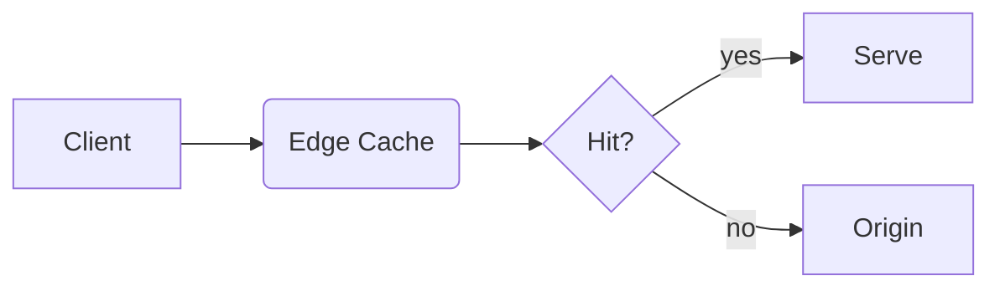

# mdslide — Complete Syntax & CLI Reference

> This is the canonical, self-contained reference for authoring and building
> presentations with `mdslide`. It is written so that a human — or an AI agent
> with no other context — can create, update, and export a full slide deck
> from scratch. Print it any time with `mdslide llms`.

`mdslide` compiles a single standard Markdown (`.md`) file into an interactive
slide deck exported as **HTML**, **PDF**, or **PowerPoint (PPTX)**. You never
touch a GUI: author Markdown, run the CLI.

---

## Recommended Workflow (for AI agents)

1. **Write** a `slides.md` file using the syntax below.
2. **Validate**: `mdslide validate slides.md` — fix any overflow or annotation
   warnings it reports before delivering.
3. **Preview or export**:
   - Live preview with hot-reload: `mdslide watch slides.md --port 3500 --open`
   - Standalone HTML: `mdslide compile slides.md -o deck.html`
   - PDF: `mdslide compile slides.md -o deck.pdf`
   - PowerPoint: `mdslide compile slides.md -o deck.pptx --pptx-mode editable`
4. **Update**: edit the Markdown file, re-run `validate`, recompile. If a
   `watch` server is running, saving the file hot-reloads the browser
   automatically — no restart needed.

Avoid running bare `mdslide slides.md` in automated contexts: it launches an
interactive wizard that requires a human at the keyboard. Always use the
explicit `compile` / `watch` / `validate` subcommands with flags.

---

## 1. Presentation File Structure

A presentation is one Markdown file with three kinds of building blocks:

```markdown
---
title: My Deck # ← 1. YAML frontmatter: global defaults (optional)
theme: gradient
---

<!-- layout: title -->    # ← 3. HTML comment annotations: per-slide overrides

# First Slide

--- # ← 2. Slide separator: `---` on its own empty line

## Second Slide

- Content here
```

### Slide separation

- **Explicit (recommended)**: three dashes `---` on an empty line start a new
  slide.
- **Auto-separation**: if the file contains no `---` dividers, the compiler
  automatically starts a new slide at every Level-2 heading (`##`).

---

## 2. Global Frontmatter (applies to all slides)

Optional YAML block between `---` boundaries at the very top of the file:

```yaml
---
title: Product Kickoff 2026
theme: gradient
titleAlign: center
titlePosition: top
animation: slide-up
overflow: split
---
```

| YAML Key                 | Allowed Values                                                              | Description                                                        |
| :----------------------- | :-------------------------------------------------------------------------- | :----------------------------------------------------------------- |
| `title`                  | Any text                                                                    | Presentation title (used in compiled HTML metadata).               |
| `theme`                  | `light`, `dark`, `notion`, `terminal`, `gradient`, `corporate`, `solarized` | Overall visual theme and color scheme. Global only.                |
| `titleAlign`             | `left`, `center`, `right`                                                   | Default horizontal alignment for slide titles.                     |
| `titlePosition`          | `top`, `center`, `bottom`                                                   | Default vertical position for slide titles.                        |
| `animation` (or `build`) | `fade`, `slide-up`, `slide-left`, `slide-right`, `zoom`                     | Default step-by-step reveal animation for list items and images.   |
| `overflow`               | `split`, `none`                                                             | Enables/disables the auto-splitting engine for overflowing slides. |

Frontmatter values are **defaults**; any slide can override them locally with
a comment annotation (below). The slide-level value always wins for that slide.

---

## 3. Per-Slide Comment Annotations

Place standard HTML comments inside a slide (typically near the top) to
override settings for that slide only:

```markdown
# Target Metrics

<!-- titleAlign: center -->
<!-- animation: zoom -->

- Metric A
- Metric B
```

| Annotation                           | Allowed Values                                                               | Description                                            |
| :----------------------------------- | :--------------------------------------------------------------------------- | :----------------------------------------------------- |
| `<!-- layout: value -->`             | `title`, `bullets`, `code`, `visual`, `quote`, `table`, `statement`, `split` | Force a specific layout for this slide.                |
| `<!-- titleAlign: value -->`         | `left`, `center`, `right`                                                    | Horizontal title alignment for this slide.             |
| `<!-- titlePosition: value -->`      | `top`, `center`, `bottom`                                                    | Vertical title placement for this slide.               |
| `<!-- animation: value -->`          | `fade`, `slide-up`, `slide-left`, `slide-right`, `zoom`                      | Reveal animation for this slide's list items/elements. |
| `<!-- overflow: value -->`           | `split`, `none`                                                              | Enable/disable auto-splitting for this slide only.     |
| `<!-- backgroundImage: ... -->`      | `url('...')` optionally followed by `dark` or `light`                        | Full-bleed background image (see §5).                  |
| `<!-- notes --> ... <!-- /notes -->` | Any text between the markers                                                 | Speaker notes shown only in Presenter View (see §6).   |

---

## 4. Slide Layouts

The layout engine auto-detects a fitting layout from content, but you can
force one with `<!-- layout: name -->`:

| Layout      | Use case                       | Style                                                     |
| :---------- | :----------------------------- | :-------------------------------------------------------- |
| `title`     | Cover slide, section headers   | Title + subtitle centered, extra-large fonts.             |
| `bullets`   | Bulleted summaries             | Larger list typography, accent markers, generous margins. |
| `code`      | Full-screen source code        | Code block fills the slide, optimized typography.         |
| `visual`    | Prominent images/screenshots   | Image stretched to maximum area, heading kept neat.       |
| `quote`     | Testimonials, key takeaways    | Quote centered in a highlighted glassmorphic card.        |
| `table`     | Comparison grids               | Table centered vertically and horizontally.               |
| `statement` | One big statistic or statement | Single short sentence in a massive font.                  |
| `split`     | Two-column comparisons         | Side-by-side columns (pairs with `::split::`, see below). |

### Layout examples

```markdown
<!-- layout: title -->

# My Presentation Title

## A compelling subtitle
```

```markdown
<!-- layout: quote -->

> "Make it work, make it right, make it fast."
>
> - Kent Beck
```

```markdown
<!-- layout: statement -->

10× faster than traditional tools.
```

### Two-column splits (`::split::`)

Partition any slide into two equal columns by placing `::split::` alone on an
empty line (blank lines before AND after it are required — otherwise it is
treated as body text and ignored):

```markdown
# Front-end vs Back-end

### Front-end

- React / Next.js
- Tailwind CSS

::split::

### Back-end

- Node.js / Bun
- PostgreSQL / Redis
```

### Auto-split heuristic (text + image)

If a slide contains **exactly one image** plus text and no manual `::split::`,
the compiler automatically renders a two-column layout: text on the left,
image fitted on the right. To avoid this, force a layout explicitly.

---

## 5. Background Images

```markdown
# Skyrocket Sales

<!-- backgroundImage: url('https://example.com/growth.jpg') -->
```

- **Luminance auto-detection**: dark images flip slide text to white; light
  images keep dark text with subtle drop shadows.
- **Manual override**: append `dark` or `light` inside the comment to force
  the contrast theme:

```markdown
<!-- backgroundImage: url('dark-forest.jpg') dark -->
<!-- backgroundImage: url('snowy-mountain.jpg') light -->
```

---

## 6. Speaker Notes

Text between `<!-- notes -->` and `<!-- /notes -->` is hidden from the main
presentation and shown only in the Presenter View window (opened with `P`),
alongside a presentation timer:

```markdown
# Q3 Financial Summary

- Revenue up 15%
- Net profit up 8%

<!-- notes -->

Emphasize that profit growth came from the new licensing model.
Expect questions about marketing costs.

<!-- /notes -->
```

---

## 7. Advanced Content (Math, Diagrams, GFM)

All supported out of the box — no plugins or configuration:

- **Inline math (KaTeX)**: `The theorem is $a^2 + b^2 = c^2$.`
- **Block math**: wrap LaTeX in `$$ ... $$` on separate lines for a centered
  equation.
- **Mermaid diagrams**: fenced code block with the `mermaid` language tag —
  flowcharts, sequence diagrams, state charts, Gantt timelines:

  ````markdown
  ```mermaid
  graph TD
      A[Markdown File] --> B(mdslide Compiler)
      B --> C{Output Format}
  ```
  ````

- **GitHub Flavored Markdown**: tables (`| a | b |`), task lists (`- [x]`),
  and strikethrough (`~~text~~`).

---

## 8. Custom Styling (CSS Variables)

Add a `<style>` block (conventionally at the bottom of the file) and override
CSS variables on `:root`:

```html
<style>
  @import url('https://fonts.googleapis.com/css2?family=Outfit:wght@400;700&display=swap');

  :root {
    --slide-font: 'Outfit', sans-serif; /* main font family */
    --slide-mono: 'Fira Code', monospace; /* code font family */
    --slide-bg: #0f172a; /* slide background */
    --slide-text: #f8fafc; /* body text and headings */
    --slide-accent: #f43f5e; /* links, bullet markers, borders */
    --slide-radius: 10px; /* card/code/image border radius */
  }
</style>
```

| Variable          | Purpose                                                   |
| :---------------- | :-------------------------------------------------------- |
| `--slide-font`    | Main font family (headings, lists, paragraphs, cards).    |
| `--slide-mono`    | Font family for code blocks and inline code.              |
| `--title-size`    | Primary slide title size (default `3.6rem`).              |
| `--h2-size`       | Secondary heading size (default `2.6rem`).                |
| `--h3-size`       | Tertiary heading size (default `1.8rem`).                 |
| `--body-size`     | Paragraph text size (default `1.35rem`).                  |
| `--li-size`       | List item size (default `1.3rem`).                        |
| `--code-size`     | Code block font size (default `1.1rem`).                  |
| `--slide-bg`      | Slide background color.                                   |
| `--slide-surface` | Background for quote boxes, code blocks, cards.           |
| `--slide-text`    | Main body text and heading color.                         |
| `--slide-muted`   | Footnotes, captions, muted elements.                      |
| `--slide-accent`  | Accent color: link underlines, bullet markers, borders.   |
| `--slide-border`  | Divider lines and card borders.                           |
| `--slide-radius`  | Border radius for cards, code containers, images (`6px`). |

---

## 9. CLI Command Reference

### Discovering commands and flags at runtime

The tables below document every command and flag, but the CLI itself is
always the authoritative source for the **installed** version. To
self-discover at runtime:

```bash
mdslide --help              # list all commands
mdslide compile --help      # full flag reference for one command
mdslide watch --help        # (works for every subcommand: compile, watch,
mdslide validate --help     #  init, validate, interactive)
mdslide --version           # installed CLI version
mdslide llms                # reprint this entire reference
```

If a flag in this document is rejected by the CLI, or you need an option not
listed here, run `mdslide <command> --help` and trust that output — it always
matches the binary you are running.

### `mdslide compile <input> [options]` — build a distributable file

| Flag                     | Short | Default             | Description                                                                 |
| :----------------------- | :---- | :------------------ | :-------------------------------------------------------------------------- |
| `--theme <theme>`        | `-t`  | `light`             | `light`, `dark`, `notion`, `terminal`, `gradient`, `corporate`, `solarized` |
| `--output <file>`        | `-o`  | `output.<format>`   | Output file path.                                                           |
| `--format <format>`      | `-f`  | auto from extension | `html`, `pdf`, or `pptx`.                                                   |
| `--pptx-mode <mode>`     |       | `screenshot`        | `screenshot` (pixel-perfect images) or `editable` (native PPTX shapes).     |
| `--open`                 |       | `false`             | Open the compiled file when done.                                           |
| `--strict`               |       | `false`             | Exit with an error code if validation warnings are found.                   |
| `--verbose` / `--silent` |       | `false`             | More / no console output.                                                   |

Notes:

- PDF and PPTX-screenshot exports require a local Chrome/Chromium install
  (headless browser rendering). A custom binary path can be set via
  `pdf.chromePath` in the config file.
- `--pptx-mode screenshot` preserves exact visual styling as images;
  `--pptx-mode editable` produces native, editable PowerPoint text/shapes.

### `mdslide watch <input> [options]` — live dev server with hot-reload

| Flag              | Short | Default | Description                    |
| :---------------- | :---- | :------ | :----------------------------- |
| `--port <port>`   | `-p`  | `3500`  | Dev server port.               |
| `--theme <theme>` | `-t`  | config  | Theme override during preview. |
| `--open`          |       | `false` | Open the browser on startup.   |

Saving the Markdown file recompiles and refreshes the browser automatically
via WebSocket — no restart needed between edits.

### `mdslide validate <input> [options]` — lint the deck

Checks frontmatter key/value validity, comment-annotation syntax, layout
compatibility (e.g. splitting a `title` slide), and **visual overflow**
(content exceeding slide height). Use `--strict` to turn warnings into a
non-zero exit code. Always run this after writing or updating a deck.

### `mdslide init [--force]` — scaffold a project

Creates an annotated sample `slides.md` (demonstrating layouts, animations,
split columns, math, code) and an `mdslide.config.ts` config file. `--force`
overwrites existing files. Reading the generated `slides.md` is a fast way to
learn the syntax by example.

### `mdslide <input>` / `mdslide interactive <input>` — interactive wizard

Guided prompts for theme, format, output path, and watch mode. **Requires a
human at the terminal** — automated tools should use `compile`/`watch` instead.

---

## 10. Project Config File (`mdslide.config.ts`)

Optional; sets project-wide defaults so CLI flags can be omitted:

```typescript
import { defineConfig } from '@mindfiredigital/mdslide-cli';

export default defineConfig({
  theme: 'gradient', // default theme
  output: 'dist/presentation.html', // default output path
  format: 'html', // 'html' | 'pdf' | 'pptx'
  watch: { port: 4200, open: true },
  pdf: { printBackground: true, chromePath: undefined },
});
```

CLI flags always override config file values.

---

## 11. Presentation Controls (compiled HTML)

| Key           | Action                                               |
| :------------ | :--------------------------------------------------- |
| `Space` / `→` | Next slide (or reveal next animated bullet/element). |
| `←`           | Previous slide or element.                           |
| `F`           | Toggle fullscreen.                                   |
| `P`           | Open synced Presenter View (notes + timer).          |
| `?`           | Keyboard shortcuts overlay.                          |

---

## 12. Complete Example Deck

A compact deck exercising every major feature — useful as a starting template:

````markdown
---
title: Quarterly Review
theme: gradient
titleAlign: center
animation: slide-up
overflow: split
---

<!-- layout: title -->

# Quarterly Review

## Q3 2026 · Engineering

---

## Agenda

<!-- layout: bullets -->

- Shipping highlights
- Performance numbers
- Architecture changes
- Next quarter

<!-- notes -->

Keep this under one minute; details come later.

<!-- /notes -->

---

<!-- layout: statement -->

Deploy frequency up 3× this quarter.

---

## Old vs New Pipeline

<!-- layout: split -->

### Before

- Manual releases
- 40-min builds

::split::

### After

- Continuous deploys
- 6-min builds

---

<!-- layout: code -->

## The Core Change

```typescript
export async function deploy(target: Env): Promise<Result> {
  const build = await compile({ cache: true });
  return release(build, target);
}
```

---

## Request Flow



---

## Latency Model

Response time follows $t = t_0 + \frac{n}{k}$ where:

$$
k = \text{throughput per worker}
$$

---

<!-- layout: quote -->

> "The best performance improvement is the transition from the nonworking
> state to the working state."
>
> - John Ousterhout

---

## Results

<!-- layout: table -->

| Metric     | Q2  | Q3  |
| :--------- | :-- | :-- |
| P50 (ms)   | 210 | 90  |
| Deploys/wk | 4   | 12  |

---

## Thank You

<!-- backgroundImage: url('https://example.com/team.jpg') dark -->
<!-- titlePosition: center -->

Questions?
````

Build it:

```bash
mdslide validate slides.md
mdslide compile slides.md --theme gradient -o review.html --open
```

---

## 13. Authoring Guidelines (what makes a deck good)

- **One idea per slide.** Prefer more slides over crowded ones; the validator
  flags overflow, but tight slides read better even when they fit.
- Start with a `layout: title` cover slide; use `layout: statement` slides to
  punctuate sections with a single key number or claim.
- Use `::split::` (or the one-image auto-split) instead of cramming a
  paragraph next to an image.
- Put talking points in `<!-- notes -->` blocks, not on the slide.
- Enable `overflow: split` globally when content length is unpredictable
  (e.g. generated content); the engine creates numbered continuation slides.
- Prefer frontmatter for deck-wide choices and comment annotations only for
  true exceptions — fewer overrides means a more consistent deck.
- Finish every authoring or update pass with `mdslide validate <file>` and
  fix all warnings before delivering.
