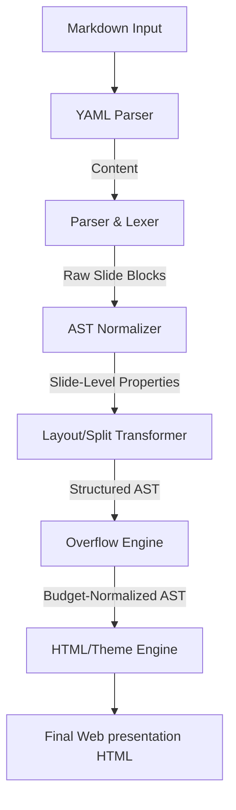

# @mindfiredigital/mdslide-core

The core compilation, normalization, and rendering engine for `mdslide`. It orchestrates the transformation of a parsed Markdown AST into interactive, styled slide decks.

## Compiler Architecture & Pipeline Flow

The compilation process is managed by the central `Compiler` class and flows through the following pipeline:



---

## Key Core Modules

### 1. Parser & Lexer (`src/parser/`)

Translates raw Markdown source string into slide chunks. Slicing boundaries are detected using a three-phase boundary resolution model:

- **Phase 1 (Explicit Dividers)**: Identifies thematic breaks (`---`), the explicit `<!-- slide -->` marker, or level-2 headings (`##`) to split slides. `<!-- slide -->` always means "start a new slide here," and — like `---` — it suppresses the `##` heuristic elsewhere in the same document, so an agent generating one slide at a time never has to guess which mode the rest of the file is in.
- **Phase 2 (Heading Boundaries)**: If none of the above are present, it splits the document at every major header level H1 (`#`) or H3 (`###`).
- **Phase 3 (Fallback Budget Chunking)**: If the document is flat text with no headers or dividers, it accumulates node layout weights until it crosses `MAX_SLIDE_SCORE` (100) and splits to maintain legibility.

### 2. Normalizer & Metadata Extractor (`src/normalizer/`)

Translates standard MDAST nodes into custom Slide AST representations. It parses and filters slide configurations declared in HTML comments:

- **Layout Overrides**: `<!-- layout: type -->` overrides layout classification (`title`, `bullets`, `code`, `visual`, `table`, `quote`, `statement`, `split`). A slide containing a `::split::`/`::col::` boundary skips this whole-slide extraction entirely (it's a no-op there) — layout is instead resolved per column by the transformer, below.
- **Background Images**: `<!-- backgroundImage: url('...') [dark|light] -->` mounts custom backgrounds.
- **Title Positioning**: `<!-- titleAlign: center -->` (horizontal alignment) and `<!-- titlePosition: bottom -->` (vertical alignment) are normalized and appended to slide data attributes.
- **Content Alignment**: `<!-- align: top|center|bottom -->` is normalized with the same top/center/bottom helper as `titlePosition`, but controls how the body content packs within its own box rather than where the title+content block sits as a group.
- **Column Hints**: `<!-- columns: N ratio:a:b:c -->` is parsed into a `columnsConfig` (count/ratio) carried on the slide for the transformer (below) to validate against the actual `::col::` markers.
- **Speaker Notes**: Text inside `<!-- notes -->...<!-- /notes -->` is extracted as slide notes.
- **Admonition Detection** (`normalizeAdmonition.ts`): a blockquote whose first paragraph starts with a recognized `[!KIND]` marker gets an `admonition` field, with the marker text stripped from its content (the marker-only paragraph is dropped entirely; inline marker+text keeps the paragraph with just the prefix removed).
- **Chart Annotations** (`parseChartAnnotations` in `normalizeLayout.ts`): unlike every other annotation here, this one is node-scoped rather than slide-scoped — a `<!-- chart: bar|line|pie -->` comment is paired with the table node immediately following it (by array adjacency, before column-splitting), attaching a `chart` field to that specific table.
- **Image Fit/Position** (`parseImageConfig` in `normalizeLayout.ts`): `<!-- imageFit: contain|cover -->` and `<!-- imagePosition: left|right -->` are parsed together, validated against a fixed value set (an invalid value is dropped with a warning), and carried on the slide.
- **Accent Color** (`parseAccentColor` in `normalizeLayout.ts`): `<!-- accentColor: ... -->` captures a freeform CSS color value verbatim (no fixed value set — validating full CSS color syntax is left to the CLI's `validate` command's lightweight shape check).

### 3. Layout & Column Transformer (`src/transformers/`)

Handles advanced multi-column transformations:

- **Manual Splits (`::split::`)**: Locates the `::split::` separator block, groups nodes on the left and right, wraps them in column sub-containers, and applies the `split` layout. Always exactly two, unratioed columns — unchanged from before.
- **N-Column Splits (`::col::`)**: Generalizes the above to any number of columns — `count(::col::) + 1` columns, checked before `::split::`. Applies the `columnsConfig` ratio hint (from the normalizer, above) to each column when its length matches the actual column count, warning and falling back to equal widths otherwise.
- **Per-Column Layout Override**: Both column-building paths (`::split::` and `::col::`) resolve each column's own layout independently via `resolveColumnLayout`, which reuses the same `resolveSlideLayout` the whole-slide path uses (`hasTitle: false`, restricted to `VALID_COLUMN_LAYOUT_TYPES` — the full `VALID_SLIDE_TYPES` set minus `title`/`split`). A `<!-- layout: xxx -->` comment inside a column's own segment forces that column's layout; otherwise it auto-detects from its own content, exactly like a whole slide would.
- **Auto-Splits**: If a slide contains exactly one image alongside text, the engine automatically splits them into a two-column layout (text on left, image on right). If a slide contains only an image, it transforms it to a full-screen `visual` layout.

### 4. Visual Overflow Engine (`src/overflow/`)

To prevent contents from bleeding out of the viewport, the overflow engine calculates the vertical size of each node in pixels:

- **Height Heuristics**:
  - Code Block: `50px` header + `24px * number of lines`.
  - Table: `35px` header + `38px * number of rows`.
  - Bullet List Item: text wrapping count (evaluated at 55 chars per line) \* `30px` + `10px` margin.
  - Image: `350px`.
  - Paragraph: text wrap count (at 65 chars/line) \* `30px` + `15px`.
  - Headings: H1: wrap count _ `65px` + `20px`; H2/H3: wrap count _ `45px` + `15px`.
- **Splitting Rules**: If the total height exceeds `680px`, it splits lists and code blocks. Remaining items are pushed onto a new continuation slide, retaining the parent settings and appending `(Cont.)` to the title.

### 5. Theme Engine (`src/themes/`)

Injects styling systems:

- Resolves base styles (like 1080p slide margins, transitions, and docks) and integrates custom CSS variables for predefined themes (`light`, `dark`, `notion`, `terminal`, `gradient`, `corporate`, `solarized`).

---

## Slide Syntax & Layout Customization

`mdslide` compiles standard Markdown files. You control structure, layout, typography, animations, and overflow behaviors using YAML frontmatter (for global defaults) and HTML comment annotations (for slide-specific overrides).

### 1. Settings Inheritance & Overrides

Settings can be defined both globally and locally:

- **Global Defaults**: Defined at the very top of your presentation file using YAML frontmatter. These settings apply to all slides.
- **Slide-Specific Overrides**: Declared inside individual slides using HTML comment annotations. When a slide-specific setting is present, it **overrides the global default** for that slide only.

---

### 2. Slide Separation

- **`<!-- slide -->`**: Always starts a new slide, independent of heading structure — recommended when generating one slide at a time.
- **Manual Separation**: Add `---` on a blank line to start a new slide.
- **Automatic Separation**: Level-2 headings (`##`) automatically start a new slide unless the above are used.

---

### 3. Layout Comments & Overrides

You can manually force a specific layout style on any slide using an HTML comment:

- `<!-- layout: title -->` (Main title layout)
- `<!-- layout: bullets -->` (Bumps font size and styles lists nicely)
- `<!-- layout: code -->` (Full-width preformatted syntax highlighted code block)
- `<!-- layout: visual -->` (Displays images prominently)
- `<!-- layout: quote -->` (Stylized blockquote focus)
- `<!-- layout: table -->` (Formats tables centrally)
- `<!-- layout: statement -->` (Giant centered message layout)
- `<!-- layout: split -->` (Multi-column content structure layout)

---

### 4. Advanced Layouts & Column Splitting

#### **Manual Column Split (`::split::`)**

To split a slide into two equal side-by-side columns:

```markdown
# Columns Layout

Left Column contents.

- Item A
- Item B

::split::

Right Column contents.

- Item C
- Item D
```

#### **N-Column Split (`::col::`)**

For more than two columns, use `::col::` between each column instead of `::split::`, optionally with `<!-- columns: N ratio:a:b:c -->` for unequal widths:

```markdown
<!-- columns: 3 ratio:2:1:1 -->

Build stuff

::col::

Test stuff

::col::

Deploy stuff
```

The declared count/ratio are validated against the actual number of `::col::`-delimited segments; a mismatch falls back to equal-width columns (and `mdslide validate` warns about it).

#### **Per-Column Layout Override**

Each column resolves its own layout independently, the same way a whole slide does. Placing `<!-- layout: xxx -->` inside a specific column's segment forces that column's layout without touching its siblings:

```markdown
<!-- columns: 3 ratio:2:1:1 -->
<!-- layout: code -->

\`\`\`bash
npm run build
\`\`\`

::col::

- Smoke tests

::col::

Deploy stuff, no special layout here.
```

The first column is forced to `code`; the others auto-detect (`bullets`, `content`). Valid values exclude `title`/`split`.

#### **Automatic Split Detection**

If a slide contains exactly one image and text block, `mdslide` automatically generates a split layout with the text on one side and the image on the other. If the slide contains only a single image, it renders as a full-screen image cover slide.

---

### 5. Slide Title Alignments, Positions & Content Alignment

Override default alignments for any slide's title block:

- `<!-- titleAlign: center -->` - Horizontal alignment: `left` | `center` | `right`
- `<!-- titlePosition: bottom -->` - Vertical position: `top` | `center` | `bottom`

Independently, `<!-- align: center -->` controls how the _body content_ packs within its own space (`top` | `center` | `bottom`) — unlike `titlePosition`, it doesn't move the title, just how content sits below it. Useful for a short statement slide that shouldn't sit glued to the top.

---

### 6. Dynamic Background Images & Smart Contrast

To apply a background image to an individual slide:

```markdown
<!-- backgroundImage: url('https://example.com/image.jpg') -->
```

- **Smart Contrast Detection**: `mdslide` evaluates the image on render. If the background image is dark, slide text flips to light; if the background is light, text shifts to dark gray.
- **Forced Override**: Force a theme contrast by adding `dark` or `light` inside the comment:
  ```markdown
  <!-- backgroundImage: url('image.jpg') dark -->
  ```

---

### 7. Speaker Notes (Presenter View)

Wrap notes inside comment blocks anywhere on a slide. These will be visible in the synced Presenter console window during delivery:

```markdown
<!-- notes -->

Here are my speaker notes for this slide.

<!-- /notes -->
```

---

### 8. Mathematical Equations, GFM & Mermaid Diagrams

`mdslide` includes full support for GitHub Flavored Markdown (GFM), math formatting, and diagramming out of the box:

- **Mathematical Equations (KaTeX)**:
  - **Inline Math**: Wrap LaTeX formulas in single dollar signs `$`, e.g., `$E = mc^2$`.
  - **Block Math**: Wrap formulas in double dollar signs `$$` for centered display math:
    ```latex
    $$
    f(x) = \int_{-\infty}^{\infty} e^{-x^2} dx
    $$
    ```
- **Mermaid Diagrams**:
  - Render flowcharts, sequence diagrams, and class diagrams directly on slides using `mermaid` fenced code blocks:

    ````markdown
    ```mermaid
    graph TD
        A[Start] --> B(Process)
        B --> C{Decision}
        C -->|Yes| D[Success]
        C -->|No| E[Fail]
    ```
    ````

    ```

    ```

- **GitHub Flavored Markdown (GFM)**:
  - **Tables**: Design aligned comparison and data tables.
  - **Task Lists**: Create checkboxes with `- [ ]` and `- [x]`.
  - **Strikethrough**: Cross out text using `~~strikethrough~~`.
- **Admonitions / callouts**: a blockquote starting with `[!KIND]` (`note`,
  `tip`, `important`, `warning`, `caution`) renders as an icon + colored
  callout box instead of a plain blockquote.
- **Stats / metric grid**: a fenced code block tagged `stats`, with one
  `Label: value` pair per line, renders as a row of big-number metric cards.
- **Chart from a table**: `<!-- chart: bar|line|pie -->` immediately above a
  table renders it as an inline-SVG chart instead of a grid — the first
  column is the category axis, additional columns become chart series (a
  `pie` chart uses only the first value column).
- **Image fit/position**: `<!-- imageFit: contain|cover -->` overrides the
  scaling of every image/video on a slide; `<!-- imagePosition: left|right
-->` controls which side the image sits on in the auto-detected
  image+text split layout.
- **Video/GIF embed**: `.mp4`/`.webm` URLs in ordinary image syntax render
  as an autoplaying, looping, muted `<video>` instead of an ``; `.gif`
  is left as a plain `` since it already autoplays/loops on its own.
- **Per-slide accent color**: `<!-- accentColor: <css-color> -->` overrides
  the theme's accent color (list markers, links, borders, chart palette)
  for just that one slide.

---

### 9. Custom Typography, Colors & CSS Overrides

Customize the theme styling using standard CSS variables inside a `<style>` block:

| CSS Variable                | Category       | Description / Default Value                                                   |
| :-------------------------- | :------------- | :---------------------------------------------------------------------------- |
| `--slide-font`              | **Typography** | Main font family for headings, lists, paragraphs, and cards.                  |
| `--slide-mono`              | **Typography** | Font family for inline code and code blocks.                                  |
| `--title-size`              | **Typography** | Font size for slide titles (default: `3.6rem`).                               |
| `--h2-size` / `--h3-size`   | **Typography** | Font sizes for content headings (default: `2.6rem` / `1.8rem`).               |
| `--body-size` / `--li-size` | **Typography** | Font sizes for paragraph text and list items (default: `1.35rem` / `1.3rem`). |
| `--code-size`               | **Typography** | Font size inside code blocks (default: `1.1rem`).                             |
| `--slide-bg`                | **Colors**     | Slide background color.                                                       |
| `--slide-surface`           | **Colors**     | Card/container background color (for quotes, columns).                        |
| `--slide-text`              | **Colors**     | Main body and heading text color.                                             |
| `--slide-muted`             | **Colors**     | Color for secondary metadata or muted text.                                   |
| `--slide-accent`            | **Colors**     | Accent color used for bullet markers, links, highlights, and borders.         |
| `--slide-border`            | **Colors**     | Color for dividing lines and card borders.                                    |
| `--slide-radius`            | **Styling**    | Border-radius styling for cards, code blocks, and images (default: `6px`).    |

#### **Example Override**

```html
<style>
  /* Import distinct display fonts: Creepster (spooky) and Press Start 2P (8-bit pixel) */
  @import url('https://fonts.googleapis.com/css2?family=Creepster&family=Press+Start+2P&display=swap');

  :root {
    /* Override default fonts */
    --slide-font: 'Creepster', cursive;
    --slide-mono: 'Press Start 2P', monospace;

    /* Customize colors and styling */
    --slide-accent: #ff007f; /* Bright neon pink */
    --slide-text: #111111; /* Dark charcoal */
    --slide-radius: 12px; /* Rounder borders */
  }
</style>
```

---

### 10. Presentation Navigation & Controls

When presenting your compiled HTML slides in the browser, you can use the following keyboard shortcuts and interactive actions:

| Key / Control                | Action         | Description                                                                            |
| :--------------------------- | :------------- | :------------------------------------------------------------------------------------- |
| `Space` or `→` (Right Arrow) | Next           | Advance to the next slide (or reveal the next bullet list item/element).               |
| `←` (Left Arrow)             | Previous       | Return to the previous slide or sequential item.                                       |
| `f` / `F`                    | Fullscreen     | Toggle fullscreen mode.                                                                |
| `p` / `P`                    | Presenter View | Open a synced Presenter View window containing speaker notes and a presentation timer. |

---

## Programmatic Usage

You can invoke the compiler programmatically by importing the `Compiler` class:

```typescript
import { Compiler } from '@mindfiredigital/mdslide-core';

const compiler = new Compiler();
const result = compiler.compile(
  `# Slide 1
Content with Math: $E = mc^2$

<style>
:root {
  --slide-accent: #ff007f;
}
</style>
---
# Slide 2`,
  { theme: 'gradient' }
);

console.log(result.html); // Standalone HTML slide deck with CSS styles injected
console.log(result.slides); // Normalized Slide AST array
console.log(result.meta); // Parsed frontmatter configuration metadata
```
